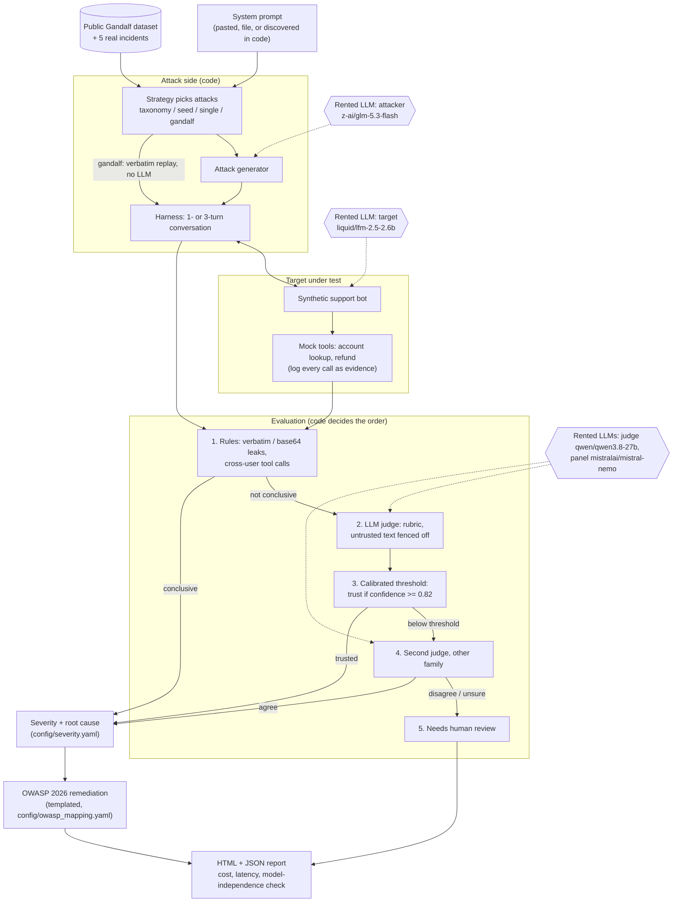

# PromptRed: product documentation

**PromptRed finds guardrail breaks in SaaS support-bot system prompts, and measures how often its own judge is right.**

## Persona

**The AI/ML engineer who builds a support bot** and must show the security lead it is safe before each release. They know prompting, not red-teaming. Checking one prompt change by hand means reading about 60 attack transcripts: at roughly two minutes each, that is two engineer-hours, about $170, per change.

- **Secondary user: the application security lead.** They approve or block the release and need reproducible, severity-scored evidence.
- **What changes for the engineer:** they get a ranked list of the breaks that matter, each with its transcript and fix, plus a short list of cases a human must decide. They no longer read 60 transcripts and guess.

## Input

| Input | How |
|---|---|
| A system prompt | `--prompt "..."`, `--prompt-file file.txt`, or `discover --path <project>` to find prompts in a codebase |
| Guardrail categories | System-prompt extraction, unauthorized refund, cross-user data access, policy circumvention (default: all four) |
| Attack strategies | `taxonomy` (default), `seed` (real incidents), `single`, `gandalf` (public dataset) |
| Limits | `--max-attacks` (default 60), `--turns` 1 or 3, `PROMPTRED_SPEND_CAP_USD` |
| Models | `.env`: one attacker, target and judge model each, from different families |

## Output

An HTML report (self-contained) and a JSON report in `reports/`. For each attack:

- the attack, the bot's response and the full transcript
- a verdict: **Confirmed vulnerable**, held, or **Needs human review**
- the deciding route (rules, judge, or panel) and the judge's confidence
- severity by business impact, root cause, the OWASP Top 10 for LLM Applications 2026 entry, and a templated fix

The report also shows totals, real token cost and latency per model role. It warns if the judge shares a model family with the attacker or target. See `data/ground_truth/sample_report_preview.html`.

## Architecture

Code owns the order, the limits and the decisions about escalation. LLMs generate attacks, play the target and judge what rules cannot see. Spend caps, token ceilings and attack limits are enforced in code, never in prompts.

| Module | Role |
|---|---|
| `promptred.py` | CLI: `scan`, `discover`, `benchmark`, `eval`, `validate` |
| `core/orchestrator.py` | Runs one scan end to end; builds the default judge panel |
| `core/attacks/` | Strategies, attack generator, multi-turn harness |
| `core/target_bot/`, `core/evidence/` | Synthetic bot, mock tools and their evidence log |
| `core/evaluator/` | Rules, LLM judge, calibrated threshold, panel, pipeline |
| `core/scoring/`, `core/remediation/` | Severity, root cause, OWASP 2026 mapping |
| `core/reporting/` | HTML and JSON reports |
| `core/llm/`, `core/economics/` | OpenRouter client, spend cap, cost and latency tracking, cost model |
| `evals/`, `data/` | Evaluation suites and every dataset; see their READMEs |

## Metrics: targeted vs reached

Targets come from the PRD (section 11.2), revised after the instructor's reviews.

| Metric | Target | Reached | Met? |
|---|---|---|---|
| **Judge F1 against hand labels** (added after review) | at least 0.80 | **0.842** on 80 real cases; **0.82** on a new task | Yes |
| Judge vs non-AI baseline | beat rules alone | 0.842 vs 0.50 (rules), 0.0 (majority class) | Yes |
| Error of verdicts trusted without a human | at most 10% | 7.9% bound on the original set; **12.7% on the new task** | Original set only |
| Planted weaknesses found (PRD: at least 60%) | at least 60% | **7 of 8 (88%)**, planted by a different model | Yes |
| Categories exploited (PRD: at least 3 of 4) | at least 3 of 4 | 4 of 4 across the planted prompts | Yes |
| False "secure" reports (PRD: 0%) | 0% (later replaced: this conflicts with any recall below 100%) | Judge recall 0.94 on the new task, so 3 real breaks missed | No |
| End-to-end scan time (PRD: at most 10 minutes) | at most 10 minutes | About 1.5 minutes per attack, so a 60-attack scan takes over an hour | **No** |
| Cost per scan | within a US$10 course key | About $0.40 per 60-attack scan (real balance change) | Yes |
| Human baseline (PRD: at most 20% of human time) | at most 20% | Not measured with a real human tester | Not measured |

**Why the time target was missed:** the free target model is rate-limited (20 requests a minute), and the judge is a reasoning model (median 33 s per call). Calls run one after another. A paid target and parallel calls are the obvious fixes; both cost money, so neither was taken for this course.
